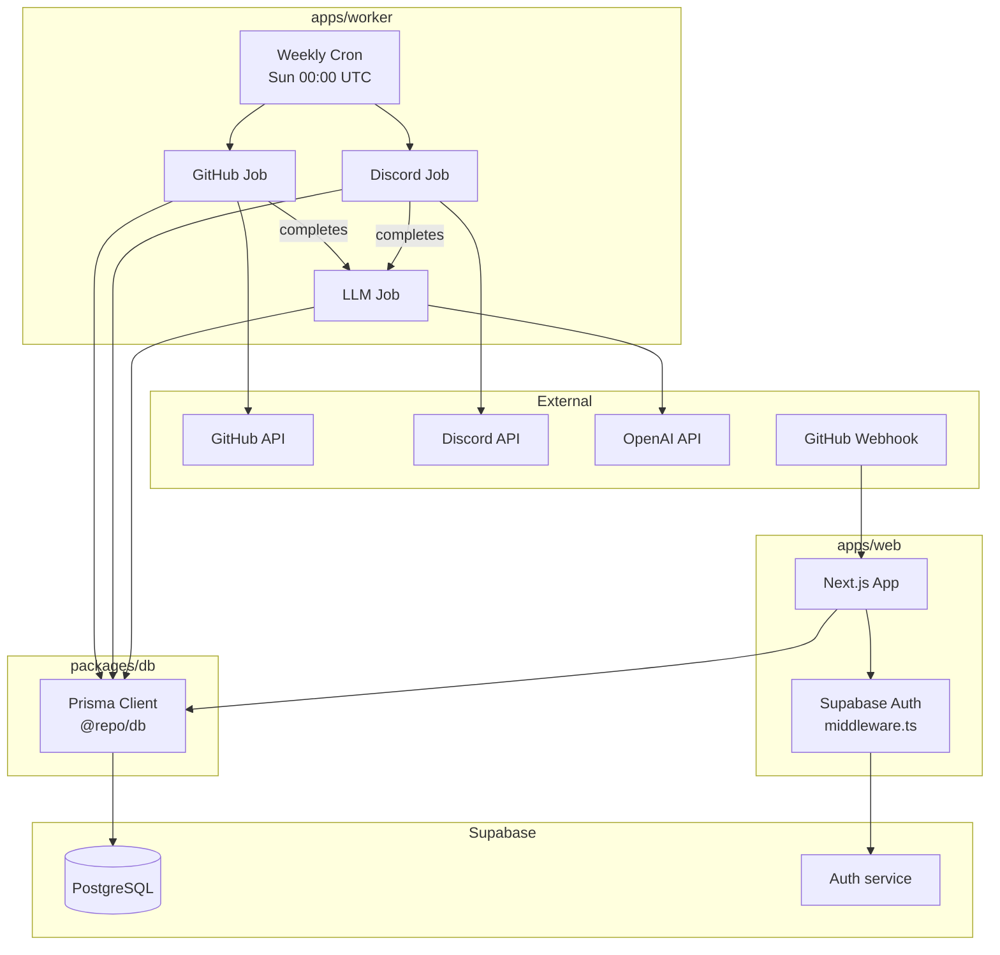
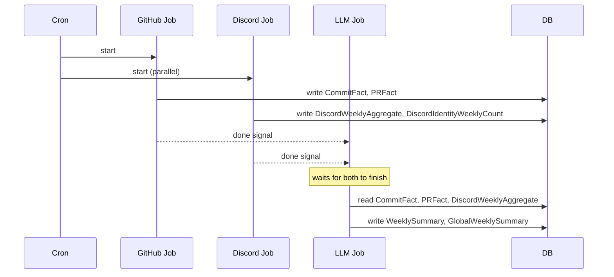
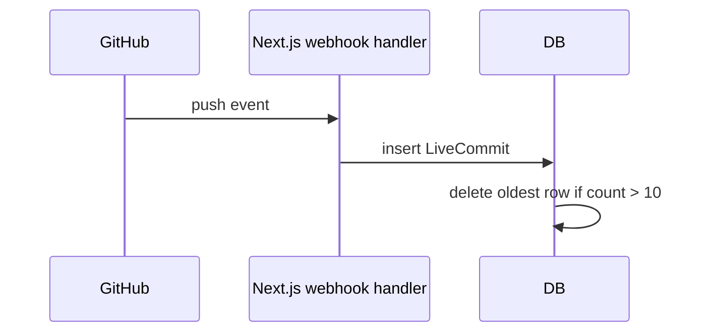
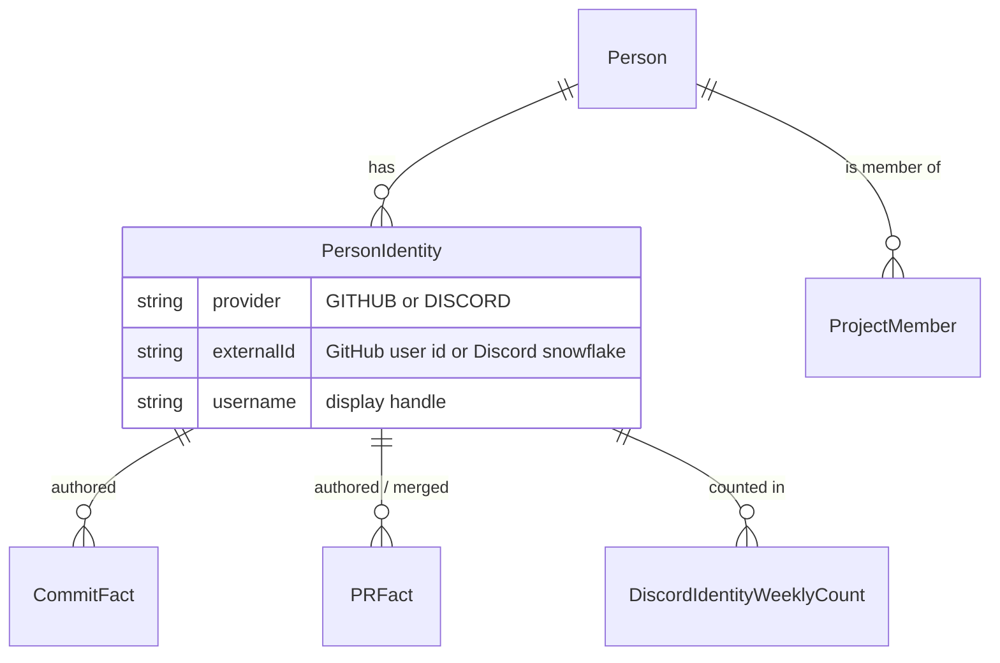

# Architecture

## Monorepo structure

The repo uses pnpm workspaces with three packages:

```
projects-health-dashboard/
├── apps/
│   ├── web/       # Next.js 15 frontend
│   └── worker/    # Node.js background cron worker
└── packages/
    └── db/        # Shared Prisma client (@repo/db)
```

`packages/db` is the shared data layer. Both `apps/web` and `apps/worker` import from it as `@repo/db`. The Prisma schema, migrations, and generated client all live here.

## System components



## Weekly data pipeline

The worker fires one cron job every Sunday at 00:00 UTC. The three jobs always run in this order:



The LLM job's dependency on both collection jobs is enforced in code via `Promise.all`, not wall-clock timing.

## Live commit feed (separate from the cron)

`LiveCommit` is a ring-buffer of the 10 most recent commits. It is fed by a GitHub webhook hitting the Next.js app — not the weekly cron. This keeps the live activity carousel on the dashboard up to date without waiting for Sunday.



## Identity resolution

Contributors have accounts on both GitHub and Discord. The schema links them through a `Person` record:



When the ingestion jobs encounter a GitHub or Discord user they cannot map to a known `Person`, they write an `UnmatchedIdentity` row. An admin reviews these in the UI and links them to the correct person.

## How the web app reads data

The web app never reads raw ingested facts directly — it reads the derived tables that the worker produces:

| What the dashboard shows          | Source table               |
| --------------------------------- | -------------------------- |
| Weekly health/velocity scores     | `WeeklyStats`              |
| Per-member contribution breakdown | `MemberWeeklyContribution` |
| Project narrative summary         | `WeeklySummary`            |
| Cross-project executive overview  | `GlobalWeeklySummary`      |
| Live commit feed                  | `LiveCommit`               |

## Technology choices

| Layer      | Technology                  | Why                                                                         |
| ---------- | --------------------------- | --------------------------------------------------------------------------- |
| Frontend   | Next.js 15 (App Router)     | SSR + React Server Components for fast initial load                         |
| Styling    | Tailwind CSS + shadcn/ui    | Utility-first with accessible component primitives                          |
| Charts     | shadcn/ui charts (Recharts) | Themed chart wrappers aligned with shadcn design tokens; backed by Recharts |
| Auth       | Supabase (Google OAuth)     | Managed auth with row-level security available                              |
| ORM        | Prisma                      | Type-safe queries, migration tooling                                        |
| Database   | PostgreSQL via Supabase     | Reliable hosted Postgres with connection pooling                            |
| Worker     | Node.js + node-cron         | Lightweight, same language as the rest of the stack                         |
| Deployment | Fly.io                      | Simple container deployments, Sydney region                                 |
