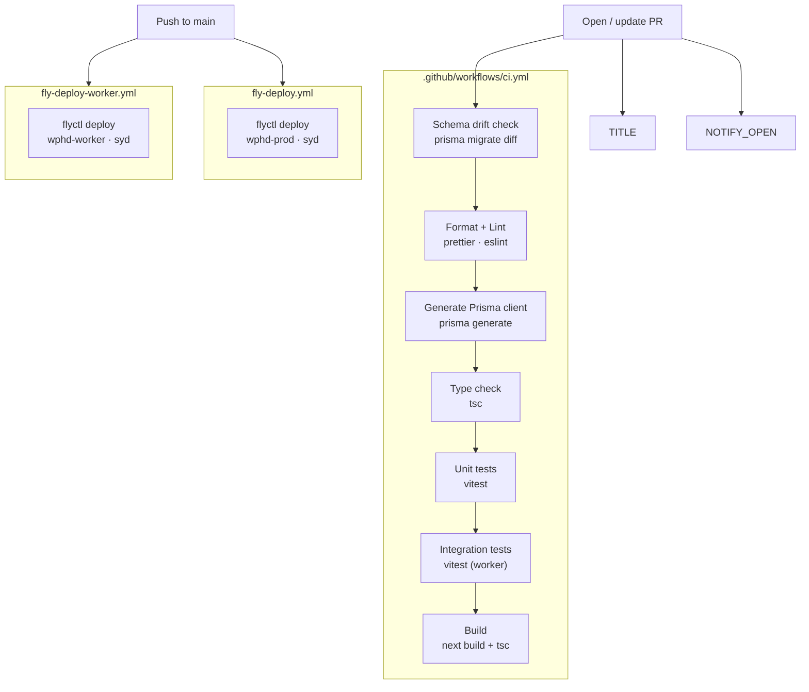

# CI/CD

## Overview

Five GitHub Actions workflows run automatically on pull requests and pushes to `main`:

| Workflow            | File                    | Trigger                                       |
| ------------------- | ----------------------- | --------------------------------------------- |
| CI                  | `ci.yml`                | PRs targeting `main`                          |
| Fly Deploy (web)    | `fly-deploy.yml`        | Push to `main`, manual dispatch               |
| Fly Deploy (worker) | `fly-deploy-worker.yml` | Push to `main`, manual dispatch               |
| PR Notifications    | `notification.yml`      | PRs opened, reopened, or merged               |
| PR Title Check      | `pr-title-check.yml`    | PRs opened, edited, reopened, or synchronised |

The two deploy workflows run independently on push to `main` — they are **not** gated on CI passing. CI only runs on pull requests.



## CI pipeline (`.github/workflows/ci.yml`)

Triggers on:

- Pull requests targeting `main`

Two jobs run in sequence — `schema-drift` must pass before `ci` starts.

### Job 1: Schema drift check

Spins up a local PostgreSQL 17.6 container as a shadow database, then runs `prisma migrate diff` to compare the live dev DB against the migration history. Fails with a printed diff if the schemas diverge (e.g. someone altered the schema directly in the Supabase dashboard without generating a migration).

Requires the `DIRECT_URL` repository secret (the dev DB session-pooler URL).

### Job 2: Lint, Format, Test & Build

| Step                   | Command                                 | What it checks                                                                   |
| ---------------------- | --------------------------------------- | -------------------------------------------------------------------------------- |
| Format check           | `pnpm format:check`                     | All files match Prettier config                                                  |
| Lint                   | `pnpm lint`                             | No ESLint errors (web uses `eslint-config-next`, others use `typescript-eslint`) |
| Generate Prisma client | `pnpm --filter @repo/db db:generate`    | Prisma client is generated before type-checking (it is not committed to git)     |
| Type check             | `pnpm typecheck`                        | No TypeScript errors across all packages                                         |
| Test                   | `pnpm test`                             | All Vitest unit tests pass                                                       |
| Integration test       | `pnpm --filter worker test:integration` | Worker integration tests pass (Testcontainers, Ryuk disabled)                    |
| Build                  | `pnpm build`                            | `next build` succeeds and worker compiles with `tsc`                             |

**Prisma generate runs before typecheck** because the generated client types are not committed to git. Without running generate first, tsc would fail on imports from `@repo/db`.

All steps must pass. A failure in any step blocks the PR from merging.

## Deployment

### Web app (`.github/workflows/fly-deploy.yml`)

Triggers on:

- Push to `main` (automatic)
- Manual dispatch via GitHub Actions UI

Deploys to Fly.io app `wphd-prod` in the `syd` (Sydney) region using `flyctl deploy --remote-only --config fly.toml`. The remote build flag means Fly.io builds the Docker image on their infrastructure, not in the GitHub runner.

### Worker (`.github/workflows/fly-deploy-worker.yml`)

Triggers on:

- Push to `main` (automatic)
- Manual dispatch via GitHub Actions UI

Deploys to Fly.io app `wphd-worker` in the `syd` (Sydney) region using `flyctl deploy --remote-only --config fly.worker.toml`.

The `FLY_API_TOKEN` secret must be set in the GitHub repository settings for both deployments to work.

## PR automation

### PR Notifications (`.github/workflows/notification.yml`)

Sends a Discord message via webhook when a PR is opened, reopened, or merged. Requires the `DISCORD_WEBHOOK_URL` repository secret.

### PR Title Check (`.github/workflows/pr-title-check.yml`)

Validates that the PR title matches the format `[#<issue>] short description` (e.g. `[#42] add Discord ingestion job`). Fails if the title does not include a linked issue number.

## Fly.io configuration

### Web app (`fly.toml` → `wphd-prod`)

| Setting       | Value                            |
| ------------- | -------------------------------- |
| App name      | `wphd-prod`                      |
| Region        | `syd` (Sydney)                   |
| Internal port | 3000                             |
| HTTPS         | Forced                           |
| Machine size  | 256 MB RAM, 1 shared CPU         |
| Auto-stop     | Yes (scales to 0 when idle)      |
| Auto-start    | Yes (starts on incoming request) |

### Worker (`fly.worker.toml` → `wphd-worker`)

| Setting      | Value                     |
| ------------ | ------------------------- |
| App name     | `wphd-worker`             |
| Region       | `syd` (Sydney)            |
| Schedule     | Weekly (Fly-managed cron) |
| Dockerfile   | `Dockerfile.worker`       |
| Machine size | 256 MB RAM, 1 shared CPU  |
| HTTP service | None                      |

## Checking deploy status

```bash
# View recent deployments
flyctl status --app wphd-prod
flyctl status --app wphd-worker

# Tail live logs
flyctl logs --app wphd-prod
flyctl logs --app wphd-worker

# List releases
flyctl releases --app wphd-prod
flyctl releases --app wphd-worker
```

You need the Fly CLI installed (`brew install flyctl` or see fly.io/docs/hands-on/install-flyctl) and access to the respective apps.

## Managing production secrets

Production environment variables are stored as Fly.io secrets — not in `.env` files or git.

```bash
# Set a secret
flyctl secrets set OPENAI_API_KEY=sk-... --app wphd-prod

# List secrets (names only — values are never shown)
flyctl secrets list --app wphd-prod
```

Setting a secret triggers an automatic redeploy.

## Running CI checks locally

Before pushing, run the same checks that CI runs:

```bash
pnpm format:check    # or pnpm format to auto-fix
pnpm lint
pnpm --filter @repo/db db:generate
pnpm typecheck
pnpm test
pnpm build
```

The pre-commit hook runs Prettier automatically on staged files, so formatting issues are usually caught before you even commit.
