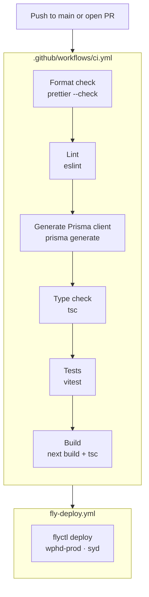

# CI/CD

## Overview

Two GitHub Actions workflows run automatically on pushes to `main`:

1. **CI** — validates the codebase (format, lint, types, tests, build)
2. **Fly Deploy** — deploys to production if CI passes



## CI pipeline (`.github/workflows/ci.yml`)

Triggers on:

- Push to `main`
- Pull requests targeting `main`

| Step                   | Command                              | What it checks                                                                   |
| ---------------------- | ------------------------------------ | -------------------------------------------------------------------------------- |
| Format check           | `pnpm format:check`                  | All files match Prettier config                                                  |
| Lint                   | `pnpm lint`                          | No ESLint errors (web uses `eslint-config-next`, others use `typescript-eslint`) |
| Generate Prisma client | `pnpm --filter @repo/db db:generate` | Prisma client is generated before type-checking (it is not committed to git)     |
| Type check             | `pnpm typecheck`                     | No TypeScript errors across all packages                                         |
| Test                   | `pnpm test`                          | All Vitest tests pass                                                            |
| Build                  | `pnpm build`                         | `next build` succeeds and worker compiles with `tsc`                             |

**Prisma generate runs before typecheck** because the generated client types are not committed to git. Without running generate first, tsc would fail on imports from `@repo/db`.

All steps must pass. A failure in any step blocks the PR from merging.

## Deployment (`.github/workflows/fly-deploy.yml`)

Triggers on:

- Push to `main` (automatic)
- Manual dispatch via GitHub Actions UI

Deploys to Fly.io app `wphd-prod` in the `syd` (Sydney) region using `flyctl deploy --remote-only`. The remote build flag means Fly.io builds the Docker image on their infrastructure, not in the GitHub runner.

The `FLY_API_TOKEN` secret must be set in the GitHub repository settings for deployments to work.

## Fly.io configuration

Defined in `fly.toml` at the repo root:

| Setting       | Value                            |
| ------------- | -------------------------------- |
| App name      | `wphd-prod`                      |
| Region        | `syd` (Sydney)                   |
| Internal port | 3000                             |
| HTTPS         | Forced                           |
| Machine size  | 256 MB RAM, 1 CPU                |
| Auto-stop     | Yes (scales to 0 when idle)      |
| Auto-start    | Yes (starts on incoming request) |

## Checking deploy status

```bash
# View recent deployments
flyctl status --app wphd-prod

# Tail live logs
flyctl logs --app wphd-prod

# List releases
flyctl releases --app wphd-prod
```

You need the Fly CLI installed (`brew install flyctl` or see fly.io/docs/hands-on/install-flyctl) and access to the `wphd-prod` app.

## Managing production secrets

Production environment variables are stored as Fly.io secrets — not in `.env` files or git.

```bash
# Set a secret
flyctl secrets set OPENAI_API_KEY=sk-... --app wphd-prod

# List secrets (names only — values are never shown)
flyctl secrets list --app wphd-prod
```

Setting a secret triggers an automatic redeploy.

## Running CI checks locally

Before pushing, run the same checks that CI runs:

```bash
pnpm format:check    # or pnpm format to auto-fix
pnpm lint
pnpm db:generate:dev
pnpm typecheck
pnpm test
pnpm build
```

The pre-commit hook runs Prettier automatically on staged files, so formatting issues are usually caught before you even commit.
