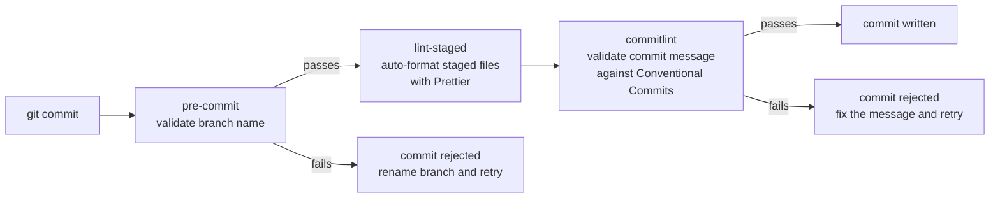

# Contributing

## Branch naming

Branches follow the format `<type>/<short-description>`, where `type` matches one of the conventional commit types below.

```
feat/live-commit-webhook
fix/discord-identity-dedup
chore/upgrade-prisma
docs/db-migration-workflow
```

Keep the description lowercase and hyphen-separated. Avoid vague names like `patch`, `updates`, or `wip`.

## Commit messages

All commits must follow the [Conventional Commits](https://www.conventionalcommits.org) specification. Non-conforming commits are rejected by the pre-commit hook (commitlint + Husky).

```
<type>(<optional scope>): <description>
```

- Subject line: lowercase, imperative mood, no trailing period, ≤ 72 characters
- Body (optional): explain _why_, not what — the diff shows what changed

**Allowed types:**

| Type       | Use for                                  |
| ---------- | ---------------------------------------- |
| `feat`     | New user-facing functionality            |
| `fix`      | Bug fix                                  |
| `docs`     | Documentation only                       |
| `style`    | Formatting, whitespace — no logic change |
| `refactor` | Restructure with no behaviour change     |
| `perf`     | Performance improvement                  |
| `test`     | Adding or correcting tests               |
| `chore`    | Tooling, dependencies, config            |
| `ci`       | CI/CD pipeline changes                   |
| `build`    | Build system changes                     |
| `revert`   | Reverts a previous commit                |

**Scopes** are optional but useful — use the package or area changed: `web`, `worker`, `db`, `auth`, `github`, `discord`, `llm`.

```
feat(worker): add retry logic to discord ingestion
fix(db): correct unique constraint on PersonIdentity
chore(web): upgrade to Next.js 15.1
```

## Pre-commit hooks

Husky runs automatically on every `git commit`. Hooks are installed when you run `pnpm install` — no manual setup needed.



## Merging and rebasing

Favour rebasing over merge commits — it keeps history linear and makes it easier to follow what changed and why.

Before opening a PR, rebase onto the latest `main`:

```bash
git fetch origin
git rebase origin/main
```

Rebase regularly when `main` is active. Smaller, frequent rebases are easier to resolve than one big conflict at the end.

After rebasing, push with `--force-with-lease` (never bare `--force`):

```bash
git push --force-with-lease origin <your-branch>
```

`--force-with-lease` is only needed when the branch already exists on the remote — rebasing rewrites commit hashes, so Git would otherwise reject the push to protect the remote's history. If the branch hasn't been pushed yet, a regular push is fine:

```bash
git push -u origin <your-branch>
```

## Pull requests

Name your PR using the format `[#<issue>] short description`, e.g. `[#42] add Discord ingestion job`. The issue number links the PR to the GitHub Projects board; the description should be a brief, lowercase summary of what changed.

Fill in the PR description explaining _why_ the change is being made:

- **Bug fixes** — describe the root cause, not just the symptom
- **Features** — describe the new behaviour
- **UI changes** — include screenshots

After CI passes and you have approvals, merge using **Rebase and merge** — this keeps `main` free of merge commits and preserves each commit individually.

Delete the branch after merging. Don't reuse old branches.

## CI requirements

Every PR must pass the full CI pipeline before it can merge. See [ci-cd.md](./ci-cd.md) for what runs.
