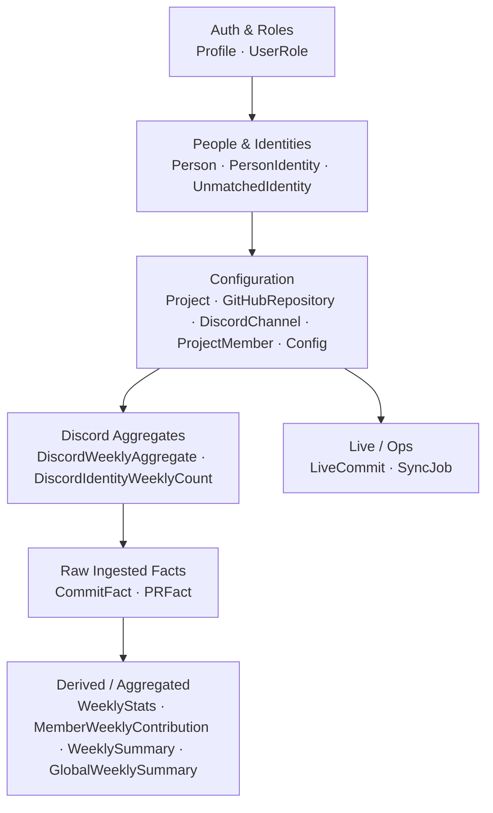
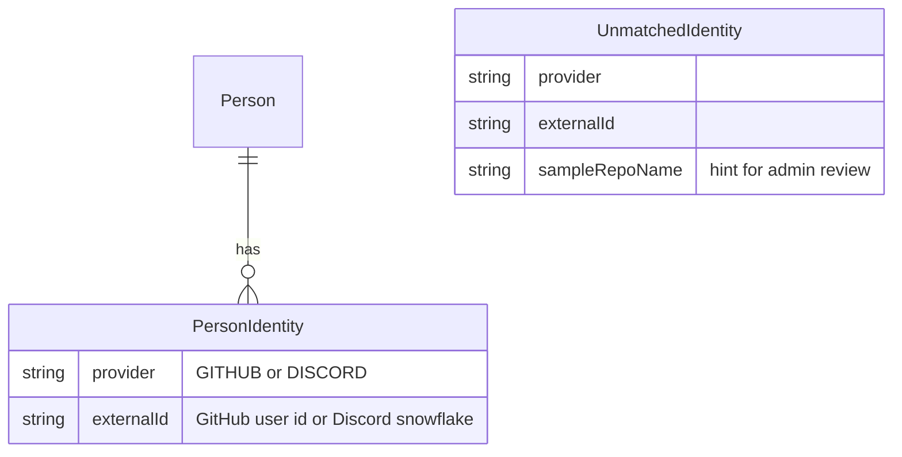
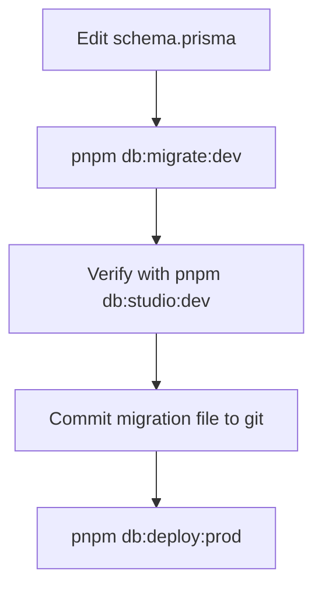

# Database

## Overview

The database is PostgreSQL, hosted on Supabase. The schema is managed with Prisma. All models and migrations live in `packages/db/prisma/`.

The shared Prisma client is exported from `@repo/db` and used by both the web app and the worker:

```typescript
import { db } from '@repo/db'

const projects = await db.project.findMany({ where: { isActive: true } })
```

## Schema layers

The schema has seven conceptual layers. Understanding the hierarchy makes it easier to navigate:



### Layer 1 — Auth & Roles

`Profile` mirrors Supabase `auth.users`. One row is created per user on first sign-in. Authorization is always by `id` (UUID), never by email — email is stored as "latest known" only.

`UserRole` is a junction table. A user can hold more than one role simultaneously (ADMIN, EXEC, MEMBER).

### Layer 2 — People & Identities

`Person` is a real human contributor, independent of any platform. It is the single identity anchor.

`PersonIdentity` links a `Person` to one external account — either a GitHub user or a Discord user. One person can have at most one identity per provider.

`UnmatchedIdentity` holds GitHub and Discord accounts seen during ingestion that could not be mapped to a known `Person`. Admins review and resolve these in the UI.



### Layer 3 — Configuration

`Project` groups everything together: repositories, channels, members, and all derived data.

`GitHubRepository` and `DiscordChannel` are the data sources monitored by the worker. One project can have multiple repos and multiple channels.

`Config` stores adjustable weights and thresholds as JSON values. `scope` is either `"GLOBAL"` or a `Project.id` — project-level entries override global defaults.

### Layer 4 — Discord Aggregates

Discord messages are never stored. The worker fetches them, aggregates counts in memory, writes these tables, then discards the raw messages.

`DiscordWeeklyAggregate` — project-level weekly totals (message count, unique authors, unmapped message count).

`DiscordIdentityWeeklyCount` — per-identity breakdown for the same week. Only covers authors who have been mapped to a `PersonIdentity`.

### Layer 5 — Raw Ingested Facts

`CommitFact` — one row per Git commit. Retained indefinitely.

`PRFact` — one row per pull request. Both open and merged PRs are captured; `mergedAt`/`closedAt` are null until the PR closes.

### Layer 6 — Derived / Aggregated

These tables are written by the worker and read by the web app. The web app does not read raw facts directly.

| Model                      | Written by            | Contains                                                                                                                                                                                                  |
| -------------------------- | --------------------- | --------------------------------------------------------------------------------------------------------------------------------------------------------------------------------------------------------- |
| `WeeklyStats`              | GitHub job            | Raw counts; 4-week rolling averages; health/velocity/sentiment scores; cumulative totals from project start; `algorithmVersion` for detecting stale scores; `mvpMember` (highest lines-changed that week) |
| `MemberWeeklyContribution` | GitHub + Discord jobs | Per-member, per-project, per-week counts                                                                                                                                                                  |
| `WeeklySummary`            | LLM job               | Narrative summary + sentiment score per project-week                                                                                                                                                      |
| `GlobalWeeklySummary`      | LLM job               | Cross-project executive overview, one row per week                                                                                                                                                        |

`sentimentScore` is denormalized from `WeeklySummary` into `WeeklyStats` so that health score and sentiment can be graphed together without a join.

### Layer 7 — Live / Ops

`LiveCommit` is a ring-buffer capped at 10 rows. Fed by the GitHub webhook, not the weekly cron. The oldest row is deleted whenever a new one would push the count above 10.

`SyncJob` is an audit log of every weekly job run (GITHUB, DISCORD, LLM). One row per project per job type per run.

## Weekly time windows

All `weekStart` fields store **Monday 00:00 UTC**. This is the convention used across every table that has a weekly time dimension. The cron fires on Monday at 00:00 UTC and processes the _previous_ Monday–Sunday week — so the `weekStart` it writes is seven days in the past relative to the fire time.

## Connection strings

Two database URLs are required:

| Variable       | Connection type    | Port | Used for                           |
| -------------- | ------------------ | ---- | ---------------------------------- |
| `DATABASE_URL` | Transaction pooler | 6543 | All runtime queries (web + worker) |
| `DIRECT_URL`   | Session pooler     | 5432 | Prisma migrations only             |

The transaction pooler does not support prepared statements or advisory locks, which Prisma needs for migrations. `DIRECT_URL` provides a connection that does. The session pooler at port 5432 is used instead of the true direct connection because the free Supabase tier's direct connection is IPv6-only and won't reach most networks.

## Migration workflow

### Dev — authoring a new migration

```bash
# Edit schema.prisma, then:
pnpm db:migrate:dev
```

This diffs the schema against the dev database, generates a new SQL file in `packages/db/prisma/migrations/`, and applies it. Commit the migration file to git.

### Prod — applying pending migrations

```bash
pnpm db:deploy:prod   # prompts for confirmation
```

This applies only the migration files that have not yet run against prod. It never creates new files and never resets data.

> **Never run `db:migrate:dev` against prod.** `migrate dev` can trigger a database reset if it detects schema drift — safe on dev where data is throwaway, catastrophic on prod. Always use `db:deploy:prod` for production.

### After any schema change

```bash
pnpm db:generate:dev   # regenerates the Prisma TypeScript client
```

Without this step, the TypeScript types will be out of sync with the schema and imports from `@repo/db` will break.

### Dev → Prod promotion checklist



## Scripts reference

| Script                  | Target | What it does                                             |
| ----------------------- | ------ | -------------------------------------------------------- |
| `pnpm db:migrate:dev`   | Dev    | Authors a new migration and applies it to dev            |
| `pnpm db:deploy:dev`    | Dev    | Applies pending migrations to dev — no creation or reset |
| `pnpm db:deploy:prod`   | Prod   | Applies pending migrations to prod after confirmation    |
| `pnpm db:generate:dev`  | Dev    | Regenerates the Prisma client                            |
| `pnpm db:generate:prod` | Prod   | Regenerates the Prisma client against prod credentials   |
| `pnpm db:studio:dev`    | Dev    | Opens Prisma Studio at localhost:5555                    |
| `pnpm db:studio:prod`   | Prod   | Opens Prisma Studio against prod                         |
