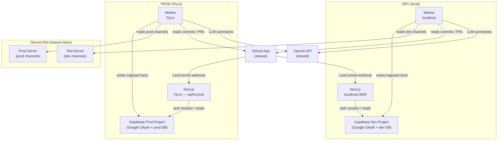

# Environments

## Overview

There are two fully isolated environments — dev and prod — each with their own Supabase project (database + auth). The GitHub App, OpenAI API, and Discord bot token are shared across both.

## Dev environment

| Component       | Where it runs                       |
| --------------- | ----------------------------------- |
| Next.js web app | `localhost:3000`                    |
| Worker          | Local process (no HTTP port)        |
| Database        | Supabase dev project                |
| Auth            | Supabase dev project (Google OAuth) |

Environment variables are loaded from `.env.dev` at the repo root. This file is gitignored and can be found in the Google Drive.

The dev Discord bot reads from a **test Discord server** — separate channels that mirror the structure of the production server but contain only test data. This prevents the worker from polluting production channels during development.

## Prod environment

| Component       | Where it runs                                   |
| --------------- | ----------------------------------------------- |
| Next.js web app | Fly.io — app `wphd-prod`, region `syd` (Sydney) |
| Worker          | Fly.io — same app, separate process             |
| Database        | Supabase prod project                           |
| Auth            | Supabase prod project (Google OAuth)            |

Environment variables are stored as Fly.io secrets (not committed to git). They are set once via `flyctl secrets set` and injected at runtime.

Prod deployments are triggered automatically when a commit is pushed to `main`. See [ci-cd.md](./ci-cd.md).

## Shared services

| Service     | Scope                           | Note                                                                    |
| ----------- | ------------------------------- | ----------------------------------------------------------------------- |
| GitHub App  | Shared across dev + prod        | Same App ID and private key; different webhook targets                  |
| OpenAI API  | Shared across dev + prod        | Usage from both environments hits the same API key and billing          |
| Discord bot | Shared token, different servers | Dev bot reads test server channels; prod bot reads prod server channels |

## Environment files

| File           | Purpose                                                        | Committed?      |
| -------------- | -------------------------------------------------------------- | --------------- |
| `.env.example` | Template — all required variable names with empty values       | Yes             |
| `.env.dev`     | Dev credentials                                                | No (gitignored) |
| `.env`         | Prod credentials for local use (e.g. running `db:deploy:prod`) | No (gitignored) |

All database scripts are wrapped with `dotenv-cli` to load the correct env file automatically. For example, `db:migrate:dev` loads `.env.dev` and `db:deploy:prod` loads `.env` (and prompts for confirmation before running).

## Google OAuth redirect URLs

Each Supabase project has its own list of allowed OAuth redirect URLs. If Google OAuth doesn't work after cloning, your local URL (`http://localhost:3000`) probably isn't whitelisted in the dev Supabase project. An admin needs to add it under Authentication → URL Configuration.
