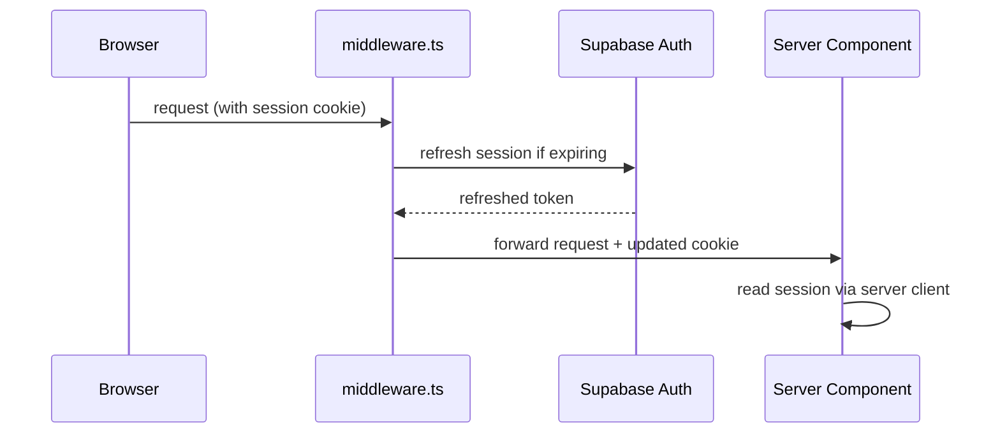

# Web App

## What it is

`apps/web` is the Next.js 15 frontend. It renders the dashboards that executives and admins use to view project health data produced by the worker.

Start it with:

```bash
pnpm --filter web dev      # development server at localhost:3000
pnpm --filter web build    # production build
pnpm --filter web lint     # lint
```

## App Router structure

The app uses Next.js App Router (the `app/` directory). Routes are organised using route groups — folders wrapped in parentheses that affect layout inheritance but not the URL.

```
apps/web/src/app/
├── layout.tsx           # Root layout (applies to all routes)
└── (public)/            # Unauthenticated views
    └── page.tsx         # Public dashboard — currently a placeholder
```

Route groups allow different layouts for authenticated vs. unauthenticated pages without changing their URLs. As protected views are added, they will live in a separate group (e.g. `(dashboard)/`) with a layout that enforces authentication.

## Authentication

Auth is handled by Supabase with Google OAuth as the provider.

**`middleware.ts`** runs on every request. It calls Supabase to refresh the user's session token if it is close to expiring, then writes the refreshed token back to the response cookies. This keeps the session alive without the user needing to re-login.

**Two Supabase client utilities:**

| File                     | Use for                                                   |
| ------------------------ | --------------------------------------------------------- |
| `lib/supabase/client.ts` | Client components (`'use client'`) — runs in the browser  |
| `lib/supabase/server.ts` | Server components and route handlers — runs on the server |

Use the **server client** in Server Components, Route Handlers (`app/api/.../route.ts`), Server Actions, and `middleware.ts`. Use the **browser client** only in `'use client'` components that must trigger auth interactions in the browser (e.g. a sign-in/sign-out button). All data fetching should go through the server client.



## Component structure

```
apps/web/src/
├── app/              # Routes and layouts (Next.js App Router)
├── components/
│   ├── ui/           # shadcn/ui primitives (Button, Card, etc.)
│   ├── dashboard/    # Dashboard-specific composite components
│   └── charts/       # shadcn/ui chart wrappers
└── lib/
    └── supabase/     # Auth utilities (client.ts, server.ts)
```

**`components/ui/`** — shadcn/ui primitives. These are generated components that live in the repo (not inside `node_modules`). To add a new one: `npx shadcn@latest add <component-name>`. Don't edit these directly; extend them via the components above.

**`components/dashboard/`** — page-level composite components. These assemble primitives from `ui/` and data from the database into meaningful views.

**`components/charts/`** — chart components built on top of the shadcn/ui chart primitives (`components/ui/chart.tsx`). Charts are placed here to keep chart-specific configuration out of page components.

## Path aliases

`@/*` maps to `apps/web/src/*`. Use it for all imports within the web app:

```typescript
import { Button } from '@/components/ui/button'
import { createClient } from '@/lib/supabase/server'
```

## Importing from @repo/db

The web app imports the shared Prisma client directly:

```typescript
import { db } from '@repo/db'
```

`@repo/db` is transpiled at build time via `transpilePackages` in `next.config.ts`. This is already configured — you don't need to change it when adding new models. If you see a build error about `@repo/db` not being transpiled, check `next.config.ts`.

## Styling

Tailwind CSS is configured at the repo root. shadcn/ui components use CSS variables for theming, defined in `src/app/globals.css`.

To add a new shadcn/ui component:

```bash
npx shadcn@latest add <component-name>
```

This writes the component source into `src/components/ui/`. Commit it like any other source file.
