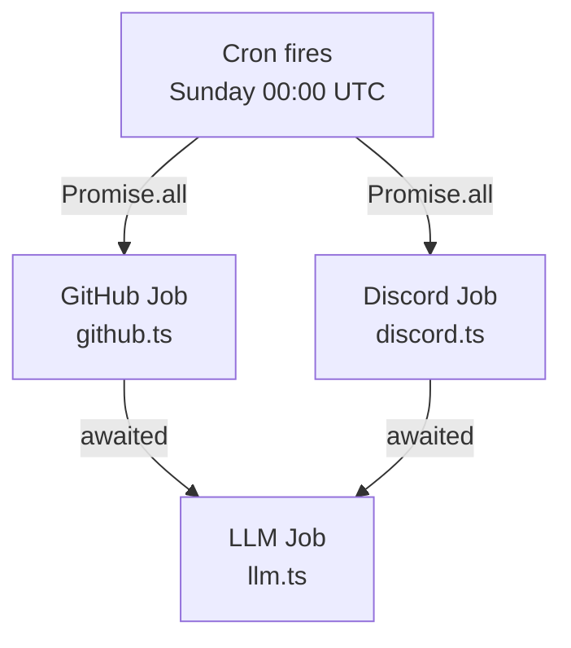
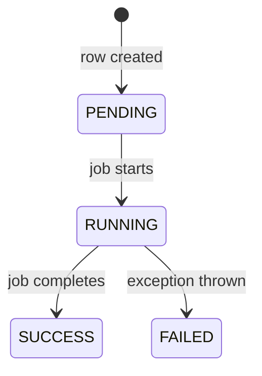

# Worker

## What it is

`apps/worker` is a Node.js process that runs one weekly cron job. It has no HTTP server and no user-facing interface — its only job is to ingest data from external APIs and write it to the database.

It is started with:

```bash
pnpm --filter worker dev   # development (tsx watch, hot-reload)
pnpm --filter worker build # compile to apps/worker/dist/
```

In production it runs as a Docker container on Fly.io alongside the web app.

## Job structure

The cron fires every **Sunday at 00:00 UTC** (`0 0 * * 0`). Three jobs run each week:



**GitHub and Discord run in parallel.** Each independently reads from its external API and writes its own tables. Neither depends on the other.

**LLM runs after both complete.** It reads the facts written by the two collection jobs and calls OpenAI. The dependency is enforced with `await Promise.all([runGitHubIngestion(), runDiscordIngestion()])` before `runLlmAnalysis()` is called.

## What each job does

### GitHub job (`jobs/github.ts`)

- Authenticates as the GitHub App using the installation ID stored on each `GitHubRepository`
- Fetches commits and pull requests for the past week across all active repositories
- Writes `CommitFact` (one row per commit) and `PRFact` (one row per PR)
- Resolves commit authors and PR authors/mergers to `PersonIdentity` records
- Writes any unrecognised GitHub users to `UnmatchedIdentity`
- Updates `WeeklyStats` with raw counts and rolling averages

### Discord job (`jobs/discord.ts`)

- Connects to Discord using the bot token
- Reads the past week of messages from all `DiscordChannel` records
- Writes `DiscordWeeklyAggregate` (project-level totals) and `DiscordIdentityWeeklyCount` (per-identity breakdown for mapped authors)
- Writes any unrecognised Discord users to `UnmatchedIdentity`
- Returns the raw messages in-memory to the orchestrator — they are never persisted

### LLM job (`jobs/llm.ts`)

- Reads `CommitFact` and `PRFact` from the database for the week just ingested
- Receives raw Discord messages in-memory (passed directly from the Discord job, never stored)
- Builds a prompt and calls OpenAI
- Writes `WeeklySummary` per project (narrative + sentiment score)
- Writes `GlobalWeeklySummary` (cross-project executive overview)
- Denormalizes `sentimentScore` from `WeeklySummary` back into `WeeklyStats` so it can be graphed alongside health scores

> **Current status:** all three jobs are stubbed — they exist as empty functions that throw `'Not implemented'`. The schema is ready to receive data but nothing is ingested yet.

## Running the jobs manually

The cron fires on Sundays only. During development, trigger a job run directly:

```typescript
// apps/worker/src/index.ts — call the job functions directly for ad-hoc testing
import { runGitHubIngestion } from './jobs/github'
await runGitHubIngestion()
```

Or add a one-shot script in `apps/worker/src/` and run it with:

```bash
pnpm --filter worker exec tsx src/your-script.ts
```

## Logging

The worker uses a minimal logger in `lib/logger.ts` that prefixes every line with an ISO timestamp:

```
[2026-03-28T00:00:01.234Z] INFO  Starting weekly ingestion jobs
[2026-03-28T00:00:02.345Z] ERROR GitHub ingestion failed: ...
```

Use `logger.info()`, `logger.warn()`, and `logger.error()`. Do not use `console.log` directly — it won't include timestamps, which makes log correlation harder.

## SyncJob audit trail

Every job run is tracked in the `SyncJob` table. One row is created per project per job type when the scheduler fires, then updated with the outcome (SUCCESS or FAILED), duration, and item count.



This gives visibility into which projects succeeded and which failed without needing to read raw logs.

## File structure

```
apps/worker/src/
├── index.ts          # Cron entry point — registers the Sunday job
├── jobs/
│   ├── github.ts     # GitHub ingestion
│   ├── discord.ts    # Discord ingestion
│   └── llm.ts        # LLM analysis
└── lib/
    └── logger.ts     # Timestamp logger
```

## Environment variables used by the worker

| Variable                 | Purpose                                                  |
| ------------------------ | -------------------------------------------------------- |
| `DATABASE_URL`           | Runtime database queries (transaction pooler, port 6543) |
| `DIRECT_URL`             | Not used at runtime — only needed for migrations         |
| `GITHUB_APP_ID`          | GitHub App authentication                                |
| `GITHUB_APP_PRIVATE_KEY` | GitHub App authentication                                |
| `DISCORD_BOT_TOKEN`      | Discord API access                                       |
| `OPENAI_API_KEY`         | LLM calls                                                |
